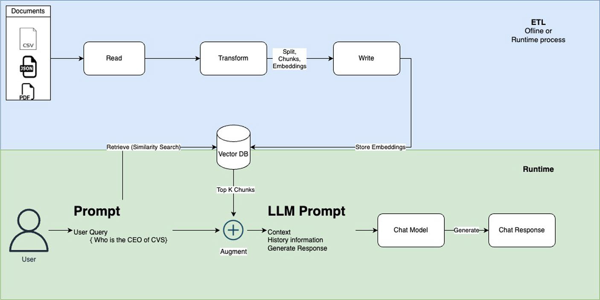

## RAG system demo
This is a Spring AI-powered Retrieval-Augmented Generation (RAG) application that allows users to upload documents and query information using vector search. It supports PostgreSQL with pgvector for vector storage and can use **Ollama** for embeddings and model queries.




#### Architecture
The System is based on the following components:
1. Code - spring boot framework with spring ai.
2. Local models deployment, including chat and embeddings generation: ollama.
3. Vector Database, for storing embeddings and querying them: postgres pgvector.
   All components used are free and open source.

#### Running the system
##### Prerequisites
- Docker
- Docker Compose
- Maven
- Java 17
- Spring Boot 3.4.2
- Spring AI 1.0.0-M5
- Postgres pgvector latest
- Ollama latest
- Deepseek AI

### Start the Application in mode dev

##### start infrastructure
```bash
docker-compose -f compose-ollama.yml up -d
docker exec -it ollama ollama pull nomic-embed-text
docker exec -it ollama ollama pull mistral
```

##### Verify the models
```bash
docker exec -it ollama ollama list
```
##### Start the application with profile dev
Set the following in `application.yml`:
```yaml
spring:
   profiles:
      active: dev
```
Or use an environment variable:
```bash
export SPRING_PROFILES_ACTIVE=dev
./mvnw clean spring-boot:run
```

### Start the Application in mode prod

##### start infrastructure
```bash
docker-compose -f compose.yml up -d
```

##### Start the application with profile prod
Set the following in `application.yml`:
```yaml
spring:
   profiles:
      active: prod
```
Or use an environment variable:
```bash
export SPRING_PROFILES_ACTIVE=prod
export DEEP_SEEK_KEY=your_api_key
./mvnw clean spring-boot:run
```

##### Usage
- Open the browser and navigate to `http://localhost:8082/` to access the application.
- Upload a pdf document.
- Chat with the system to get answers from the document. Answers are generated using the RAG model.

### Stop the Application and Infrastructure profile dev
```bash
CTRL+C
docker compose -f compose-ollama.yml  down -v
```

### Stop the Application and Infrastructure profile prod
```bash
CTRL+C
docker compose -f compose.yml  down -v
```


